# ggufvis2

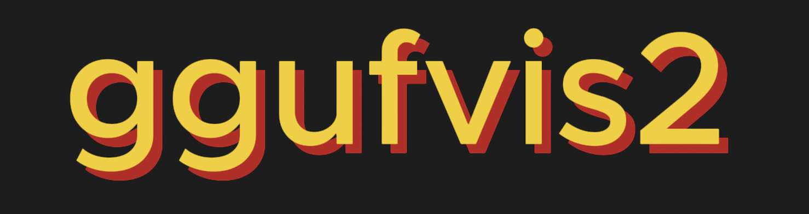

A metadata-driven terminal matrix visualizer for GGUF language models.

The visualizer reads GGUF metadata and tensor descriptors only. It never reads
or displays tensor weight values, so opening a large model does not load its
weights into memory.


[](https://github.com/imruljubair/ggufvis2/actions/workflows/tests.yml)

## Features

- Matrix-oriented transformer visualization with interactive stepping
- Dimensions, head counts, and block counts derived from GGUF
- MHA, GQA, and MQA attention layouts
- Llama, original Gemma, Qwen2/Qwen2.5, Qwen3, and DeepSeek-R1 Distill support
- Qwen Q/K normalization and projection-bias detection
- Tied and untied language-model heads
- Shape-aware annotation cards with canonical GGUF tensor sources
- Direct access to installed Ollama models through `--ollama`
- In-memory visualization from public HTTP/Hugging Face links through `--url`
- No runtime dependencies outside the Python standard library

## Demo

[](https://youtu.be/6VitPJzfYKs)

Click the preview to watch the full demo on YouTube. It shows interactive model
navigation and the Operation Explainer.

[Download the demo as an MP4](docs/media/ggufvis2-demo.mp4)

## Model view

Step through the model to highlight each operation, its equation, and the GGUF
tensor that supplies its parameters.

### TinyLlama attention

```bash
python3 ggufvis2.py --ollama tinyllama
```

<p align="center">
  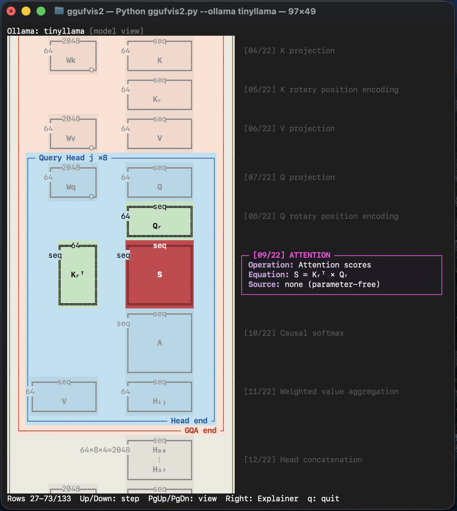
</p>

## Operation Explainer views

Press `Right` on a supported operation to inspect its matrix flow, dimensions,
selected cells, and equation. Click any preview for the full-resolution view.

<table>
  <tr>
    <td align="center"><strong>RMSNorm</strong><br><a href="docs/images/rmsnorm.png">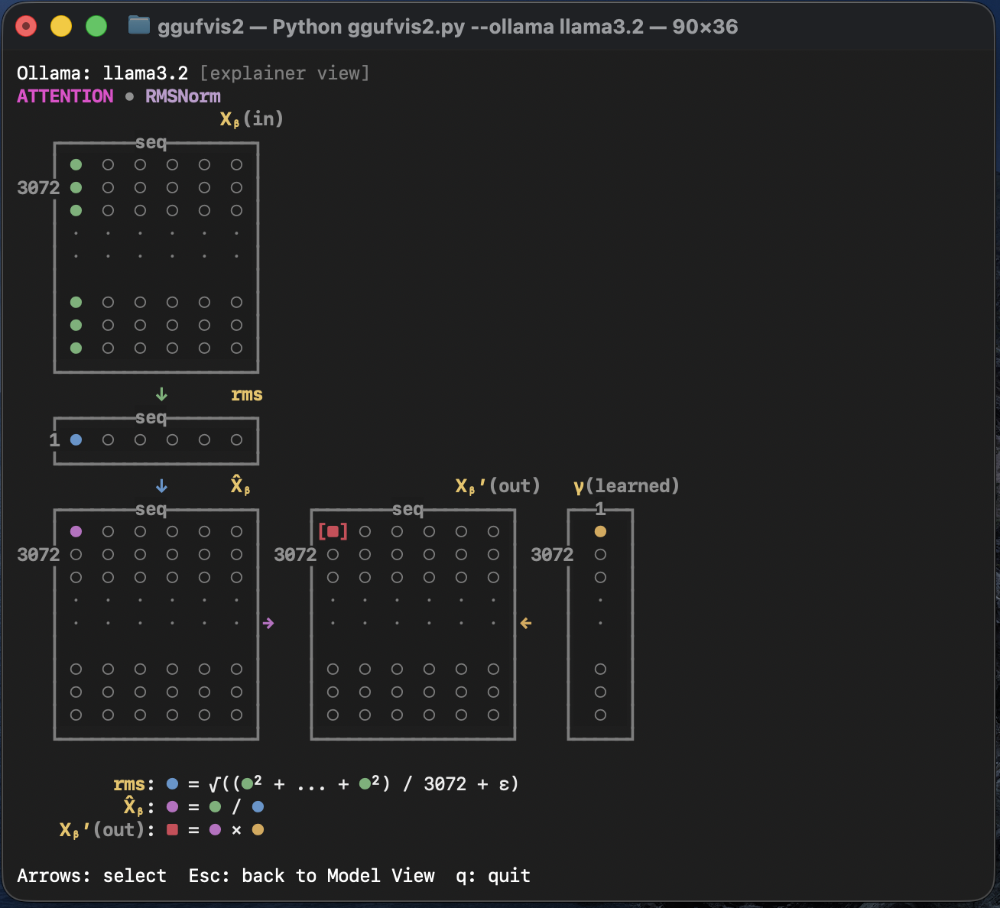</a></td>
    <td align="center"><strong>K projection</strong><br><a href="docs/images/k_proj.png"></a></td>
  </tr>
  <tr>
    <td align="center"><strong>Rotary position encoding</strong><br><a href="docs/images/rope.png">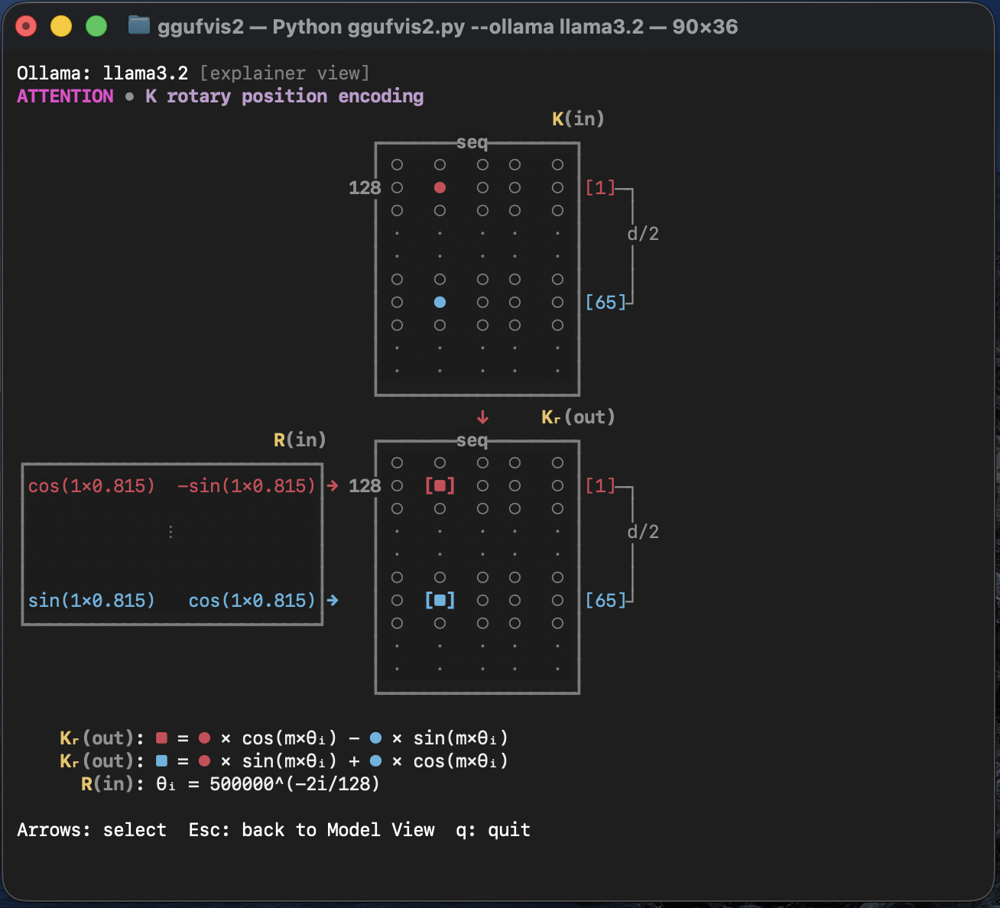</a></td>
    <td align="center"><strong>Attention scores</strong><br><a href="docs/images/attention.png">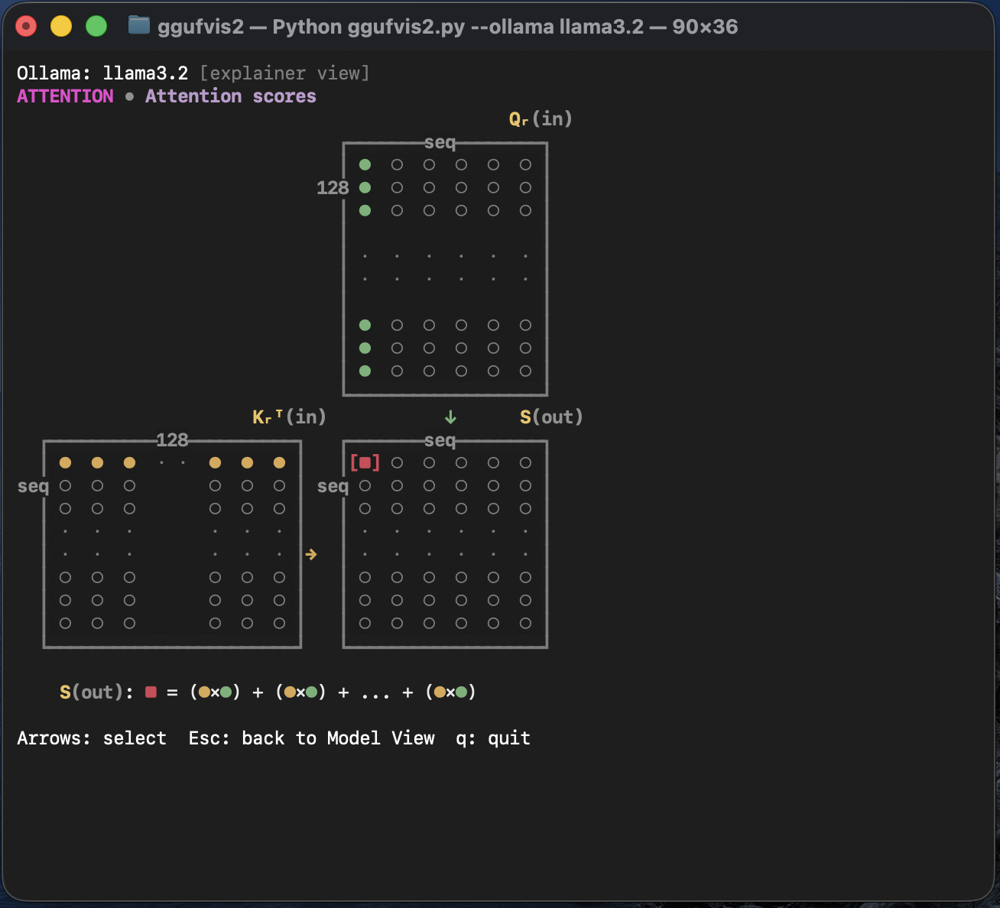</a></td>
  </tr>
  <tr>
    <td align="center"><strong>Causal softmax</strong><br><a href="docs/images/causal.png">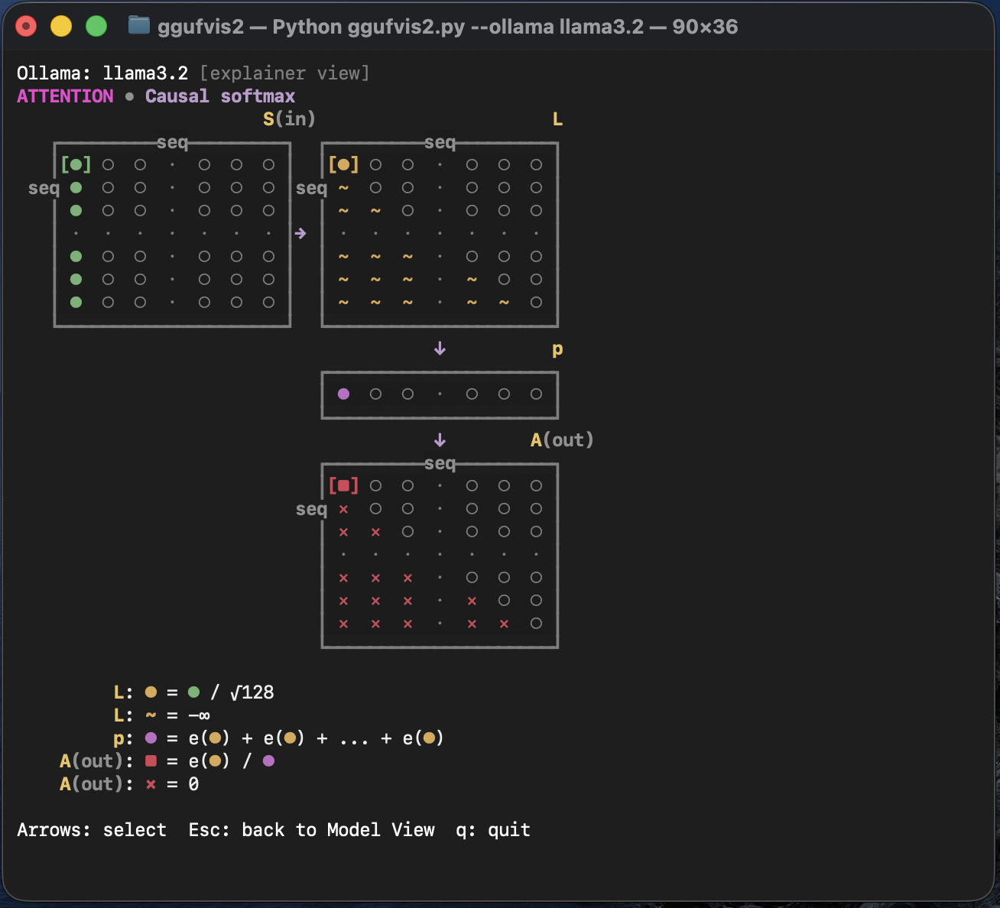</a></td>
    <td align="center"><strong>Head concatenation</strong><br><a href="docs/images/concat.png">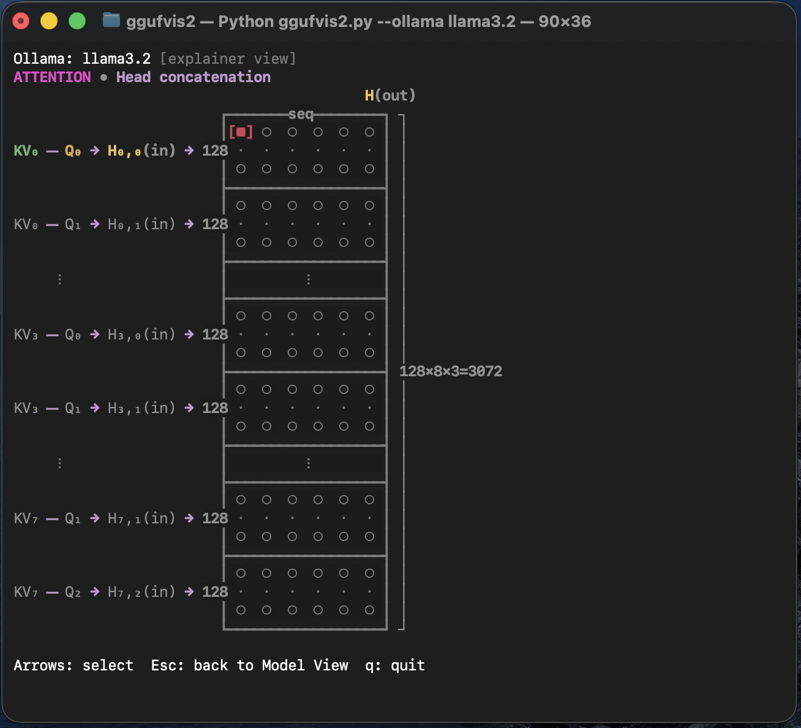</a></td>
  </tr>
  <tr>
    <td align="center"><strong>Attention residual</strong><br><a href="docs/images/residual.png">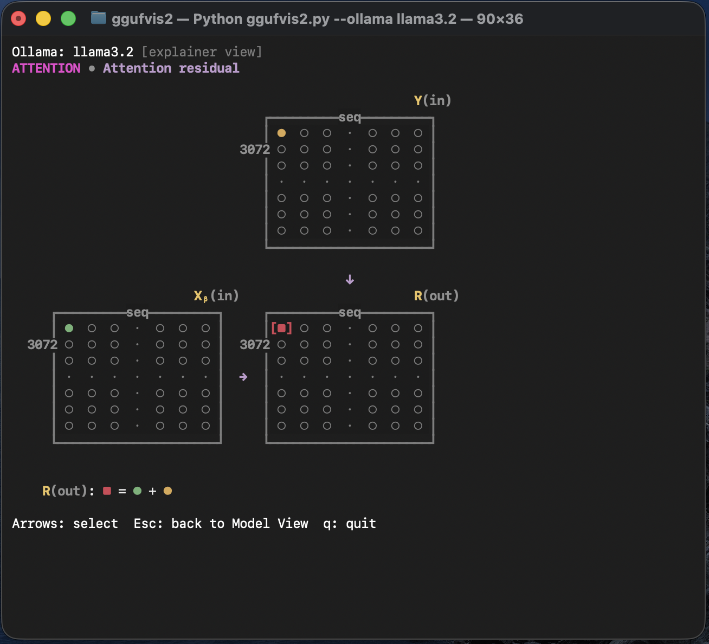</a></td>
    <td align="center"><strong>SiLU gated activation</strong><br><a href="docs/images/SiLU.png">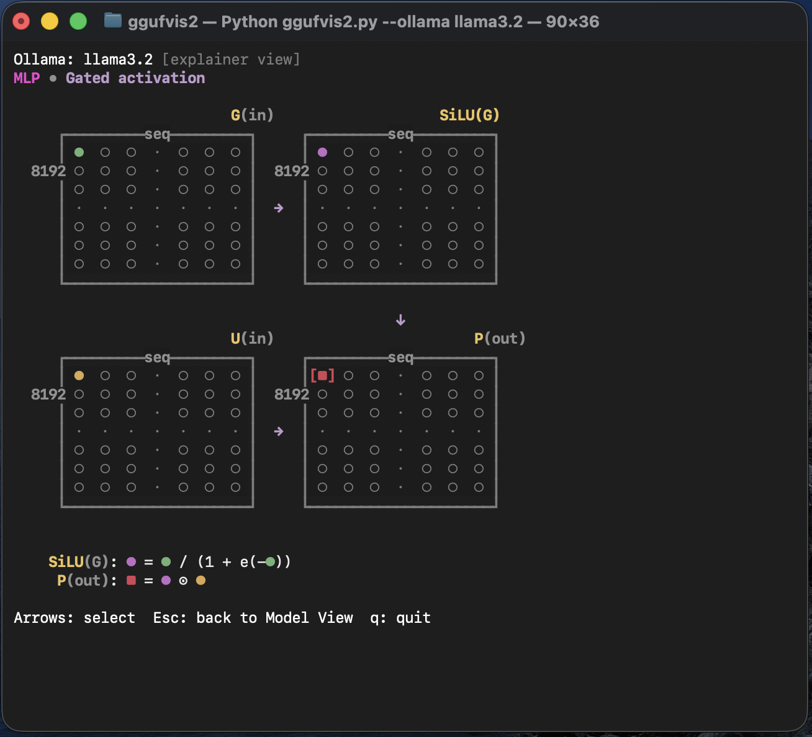</a></td>
  </tr>
</table>

## Other model views

Additional examples across operations, architectures, and input sources.

### TinyLlama feed-forward network

```bash
python3 ggufvis2.py --ollama tinyllama
```

<p align="center">
  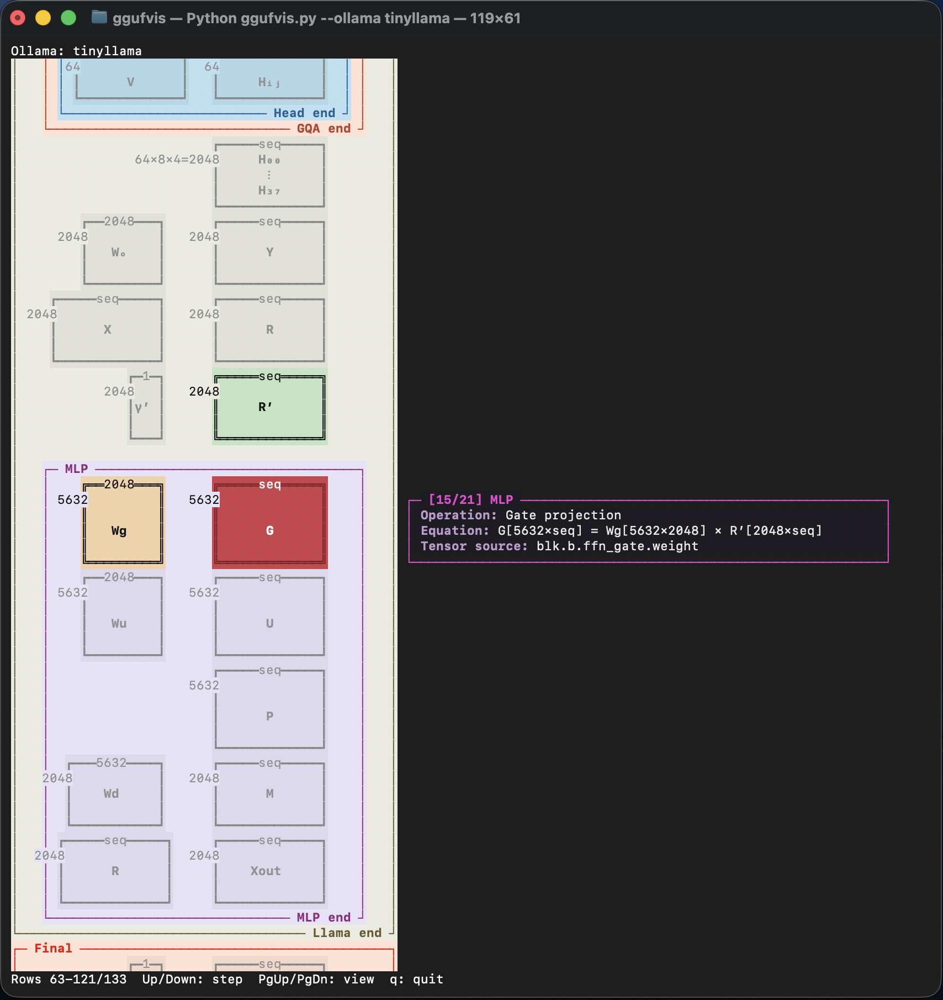
</p>

### Gemma attention

```bash
python3 ggufvis2.py --ollama gemma
```

<p align="center">
  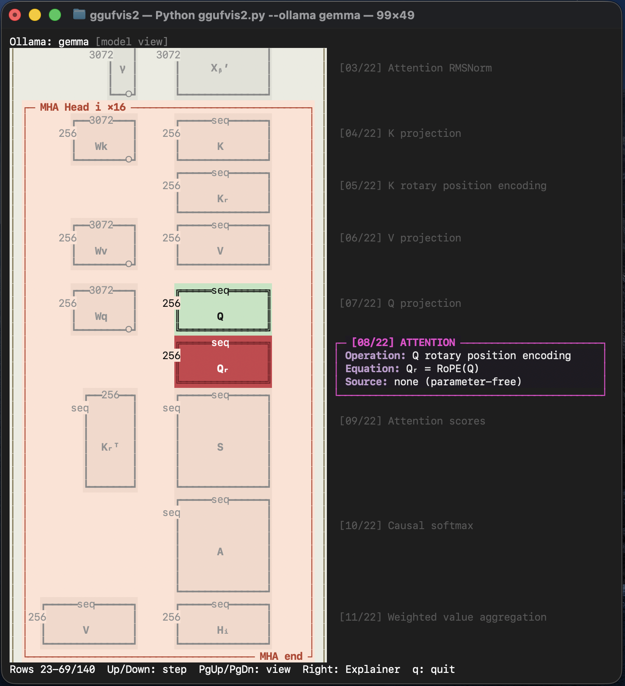
</p>

### Remote GGUF

```bash
python3 ggufvis2.py --url "https://huggingface.co/ggml-org/models-moved/blob/main/tinyllamas/stories15M-q4_0.gguf"
```

<p align="center">
  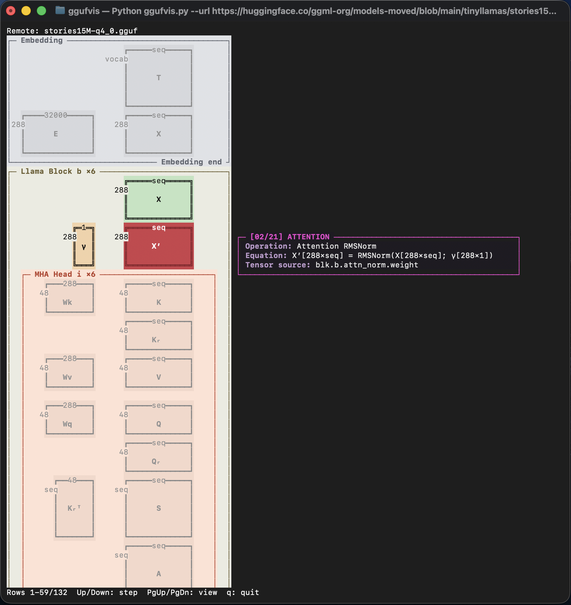
</p>

## Run

Clone the repository and run directly:

```bash
git clone https://github.com/imruljubair/ggufvis2.git
cd ggufvis2

python3 ggufvis2.py /path/to/model.gguf
python3 ggufvis2.py --ollama qwen3
python3 ggufvis2.py --ollama deepseek-r1:8b
```

Visualize a public remote GGUF without saving the full model:

```bash
python3 ggufvis2.py --url \
  https://huggingface.co/owner/repository/resolve/main/model.gguf
```

Hugging Face browser links containing `/blob/` are converted to `/resolve/`
automatically.

Or install an editable command:

```bash
python3 -m pip install -e .
ggufvis --ollama qwen3
```

Render one frame without entering interactive mode:

```bash
python3 ggufvis2.py --ollama qwen3 --static --step 4
python3 ggufvis2.py --ollama qwen3 --static --step 4 --no-color
```

Interactive keys:

- `Down`: next operation
- `Up`: previous operation
- `Right`: open the Operation Explainer for a supported step
- `Page Down` / `Page Up`: move the viewport
- `q`: quit

Inside the Operation Explainer, use all four arrow keys to move the selected output
cell. The contributing operand row, operand column, and result cell are shown
with color only; no dummy tensor values are displayed. Real dimensions overlap
the matrix borders, while compact endpoint blocks and middle dots show the
collapsed row and column contributions. Learned weights use `■`, runtime
activations use `●`, and the selected result uses `⬥`. Press `Esc` to return
to the model view. A color-matched dot-product formula appears below the
matrices.

On a wide terminal, the annotation card appears beside the matrix view. On a
narrow terminal, interactive mode automatically places the card below the
diagram instead and shows a short tip that widening the terminal restores the
side-by-side layout.

One compact source line remains above the view. It shows the local GGUF
filename, requested Ollama tag, or remote filename:

```text
Remote: DeepSeek-R1-Distill-Qwen-1.5B-Q4_K_M.gguf
```

Long source names are middle-truncated when the terminal is narrow.

Ollama resolution is enabled only by `--ollama`. A normal positional argument
is always interpreted as a filesystem path.

## Remote GGUF links

`--url` uses bounded HTTP byte-range requests. Bytes are held in memory only,
and parsing stops after the metadata and tensor-descriptor sections. The full
model is not saved locally.

The CLI reports both transferred bytes and remote file size:

```text
remote: parsed metadata and 48 tensor descriptors; transferred 64.0 KiB
of 1.1 MiB; no local model file created
```

Some network transfer is unavoidable because metadata must be read. The exact
amount depends on vocabulary metadata and tensor count, but it is normally much
smaller than the tensor payload.

Current remote-source requirements and limits:

- The link must be a direct `http://` or `https://` GGUF resource.
- The server must honor HTTP `Range` requests.
- Public Hugging Face `blob` and `resolve` links are supported.
- Private/gated repository authentication is not included in v1.
- Split GGUF models are not yet combined.
- Remote metadata/descriptor transfer is limited to 256 MiB.
- No temporary GGUF file is created.

## Supported architectures

- Dense Llama
- Original Gemma
- Dense Qwen2 and Qwen2.5 (`general.architecture = qwen2`)
- Dense Qwen3
- DeepSeek-R1 Distill models with a dense Qwen2, Qwen3, or Llama backbone

For DeepSeek-R1 Distill, the title identifies both the DeepSeek model and its
actual backbone, for example `DeepSeek-R1 Distill (Qwen2)`. The backbone from
`general.architecture` controls every matrix and dimension decision; the
DeepSeek name never substitutes a guessed architecture.

Native DeepSeek-R1/DeepSeek-V3, MoE architectures, and later Gemma
architectures are rejected explicitly instead of being rendered as if they
were structurally identical.

## Source layout

```text
ggufvis2.py             repository-local launcher
ggufvis/
  __main__.py           `python -m ggufvis` entry point
  cli.py                arguments, viewport, keyboard navigation
  gguf.py               GGUF reader and Ollama model resolution
  model.py              architecture and dimension normalization
  diagram.py            matrix and panel geometry
  explainer.py          visual-only navigable matrix-product grids
  annotations.py        equations and GGUF tensor sources
  renderer.py           terminal visualization
  terminal.py           local ANSI/Unicode canvas
tests/
  test_core.py          standalone unit tests
```

The dependency direction is straightforward:

```text
CLI
 ├─ GGUF/Ollama reader
 ├─ model normalization
 ├─ diagram layout
 └─ renderer
     ├─ annotations
     └─ terminal canvas
```

There are no imports from historical prototype versions.

## Data flow

1. `gguf.py` reads local or range-backed remote metadata and tensor descriptors.
2. `model.py` normalizes architecture-specific metadata into `ModelConfig`.
3. `diagram.py` pre-calculates all dimensions, matrix positions, and borders.
4. `annotations.py` creates the four-part card for each operation.
5. `renderer.py` draws one highlighted operation.
6. `cli.py` handles static output or interactive navigation.

## Dimension-to-height encoding

Matrix height represents dimension ordering, not literal proportional size.
For the currently installed Qwen3 8B model:

```text
1      → 3
128    → 4
4096   → 5
12288  → 6
seq    → 7
151936 → 7
```

Unique structural dimensions are sorted dynamically. Vocabulary height always
reuses the calculated sequence height.

## Annotation card

Every operation uses the same four fields:

```text
┌─ [05/24] ATTENTION ───────────────────────┐
│ Operation: K per-head RMSNorm             │
│ Equation: K′ = RMSNorm(K; γk)             │
│ Source: blk.b.attn_k_norm.weight          │
└───────────────────────────────────────────┘
```

`blk.b` means the corresponding tensor in each repeated transformer block.
Parameter-free operations say `none (parameter-free)`.

Hidden-state labels distinguish the embedding result from the repeated block
dataflow: `X` is the embedding output, `Xᵦ` enters generic block `b`, and
`Xᵦ₊₁` leaves it for the next block. The block-input annotation explains
that `Xᵦ` comes from `X` when `b=0`, or from block `b−1` otherwise; this
routing-only step intentionally has no Operation Explainer.

## Tests

```bash
python3 -m unittest discover -s tests -v
```

The tests include an explicit check that production source does not import a
historical prototype module.

## Contributing

See [CONTRIBUTING.md](CONTRIBUTING.md) for the local development and pull
request workflow.
